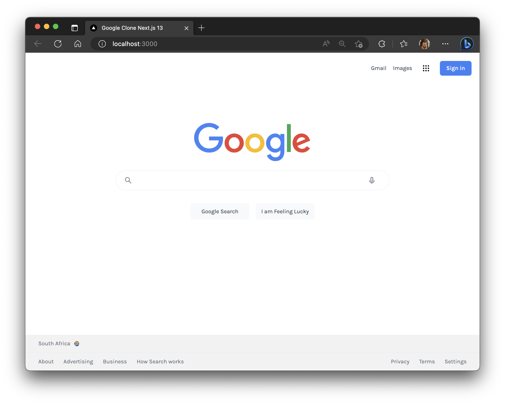
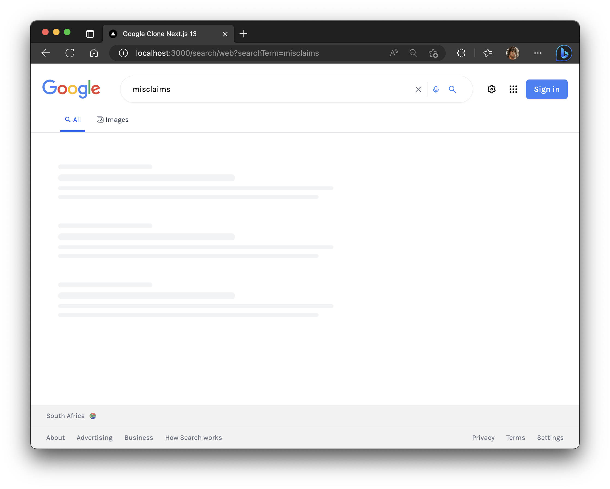

## Google Clone with Next.js 13

> Demonstrating Next.js 13 features and using Custom Search API from Google.



Featuring:

- A [Next.js](https://nextjs.org/) project bootstrapped with [`create-next-app`](https://nextjs.org/docs/api-reference/create-next-app).
- Added tailwindcss support by following the [Install Tailwind CSS with Next.js](https://tailwindcss.com/docs/guides/nextjs) guide.

- Data fetching is done/pre-rendered server-side with (Server Components).

```jsx
/* # Data Fetching Example
https://nextjs.org/blog/next-13#data-fetching
React's recent Support for Promises RFC introduces a powerful new way to fetch
data and handle promises inside components: */
// app/page.js
async function getData() {
  const res = await fetch('https://api.example.com/...');
  // The return value is *not* serialized
  // You can return Date, Map, Set, etc.
  return res.json();
}

// This request should be cached until manually invalidated.
// `force-cache` is the default and can be omitted.
// ! Similar to `getStaticProps` (ssg)
fetch(URL, { cache: 'force-cache' }); // (ssg)

// This request should be refetched on every request.
// ! Similar to `getServerSideProps` (ssr)
fetch(URL, { cache: 'no-store' }); // (ssr)

// This request should be cached with a lifetime of 10 seconds.
// ! Similar to `getStaticProps` with the `revalidate` option (isr)
fetch(URL, { next: { revalidate: 10 } }); // (isr)
```

Native `fetch` Web API has also been extended in React & Next.js. Auto de-dupes
fetch requests and caches them for revalidation of data at a component level.

This means all the benefits of (ssg), (ssr), and (isr) is now available
through one single API interface for data fetching.

- Navigation input is managed via `form` inputs in two components:

Both `HomeSearch` and `SearchBox` that are controlled components. Both use the
`useRouter` hook to navigate `push` toward `search/web` & `search/image` routes.

- Sub-segments "route segments" are `search/web` & `search/image` have their own
  data fetching done server-side as they React Server Components (RSC).

```jsx
async function getData(query, index) {
  // 👇🏻 This is a hack to simulate/test slow API response for React Suspense.
  // await new Promise((resolve) => setTimeout(resolve, 2000)); // 1 seconds
  // console.log({ query, index });
  const url = 'https://www.googleapis.com/customsearch';
  const response = await fetch(
    `${url}/v1?key=${process.env.GOOGLE_API_KEY}&cx=${process.env.CONTEXT_KEY}&q=${query.searchTerm}&start=${index}`
  );
  if (!response.ok) throw new Error('Oops! something went wrong.');
  const data = await response.json();
  return data;
}
```


- All returned results are divided up by a Pagination component.

A Client Component that makes use of `usePathname` and `useSearchParams` hooks.
They used to get the current pathname & search params from the browser URL.

```jsx
/ Pagination is the process of separating content into discrete pages. It also
// refers to the automated process of adding consecutive numbers to identify the
// sequential order of pages. Pagination is used to "break up" large amounts of
// content into smaller, manageable "chunks" here that being range of pages. For
// example, if you have 100 pages of content, you can break it up into 10 pages.
export default function PaginationButtons() {
  // `usePathname` returns path of the current route.
  const pathname = usePathname(); // 👈🏻 `/search/web` or `/search/image`
  // `useSearchParams` returns the search params of the current page.
  const searchParams = useSearchParams();
  // 👇🏻 `searchTerm: 'tesla'` or `searchTerm: 'reactjs'`
  const searchTerm = searchParams.get('searchTerm');
  // 👇🏻 `start: '1'` or `start: '11'` or `start: '21'` etc...
  const startIndex = Number(searchParams.get('start')) || 1;
  // Important: `startIndex` needs to default to 1 if not defined as Google API
  // will return an error if the start is less than 1. The `startIndex` is used
  // to tell Google "Custom Search Engine" which page of results to return. For
  // example, if `startIndex` is 1, then we increment it by 10 in our `Link`.

  // prettier-ignore
  console.log('<PaginationButtons>', { pathname, searchTerm, startIndex });

  return (
    <div className="flex justify-between gap-20 pb-16 sm:pb-4 sm:justify-start">
      {/* This only appears when the index is greater than 10. */}
      {startIndex >= 10 && (
        <Link
          // 👇🏻 We decrement `startIndex` by 10 for the previous range.Affects
          // actual `search/web/page.js` or `search/image/page.js` file.
          href={`${pathname}?searchTerm=${searchTerm}&start=${
            startIndex - 10
          }`}
        >
          <div className="flex items-center justify-center cursor-pointer hover:text-blue-700">
            <HiOutlineChevronLeft /> Prev
          </div>
        </Link>
      )}
      {/* This always appears as are index is default 1 and less than 100. */}
      {startIndex <= 99 && ( // 👈🏻 100 is the max number of results.
        <Link
          // 👇🏻 We increment `startIndex` by 10 for the next range. Affects
          // actual `search/web/page.js` or `search/image/page.js` file.
          href={`${pathname}?searchTerm=${searchTerm}&start=${
            startIndex + 10
          }`}
        >
          <div className="flex items-center justify-center cursor-pointer hover:text-blue-700">
            Next
            <HiOutlineChevronRight />
          </div>
        </Link>
      )}
    </div>
  );
}
```

- Additional to Error UI, these segments have their own Loading UI.



```jsx
function Skeleton() {
  return (
    <div className="loading-web-placeholder">
      <div className="h-2.5 w-48 loading-web-item"></div>
      <div className="h-3.5 max-w-[360px] loading-web-item"></div>
      <div className="h-2 max-w-[560px] loading-web-item"></div>
      <div className="h-2 max-w-[530px] loading-web-item"></div>
    </div>
  );
}

export default function Loading() {
  return (
    <div className="wrapper">
      <Skeleton />
      <Skeleton />
      <Skeleton />
    </div>
  );
}
```

Dependencies:

```json
"dependencies": {
  "eslint": "8.37.0",
  "eslint-config-next": "13.2.4",
  "html-react-parser": "^3.0.15",
  "next": "13.2.4",
  "react": "18.2.0",
  "react-dom": "18.2.0",
  "react-icons": "^4.8.0"
},
```

Regards, <br />
Luigi Lupini <br />
<br />
I ❤️ all things (🇮🇹 / 🛵 / ☕️ / 👨‍👩‍👧)<br />

This is a [Next.js](https://nextjs.org/) project bootstrapped with [`create-next-app`](https://github.com/vercel/next.js/tree/canary/packages/create-next-app).

## Getting Started

First, run the development server:

```bash
npm run dev
# or
yarn dev
```
